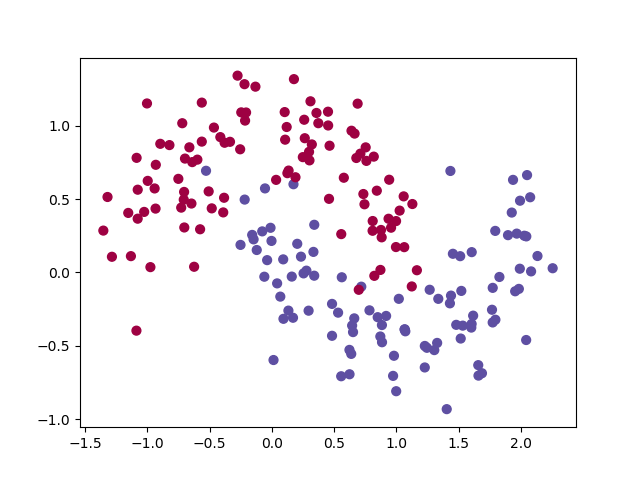
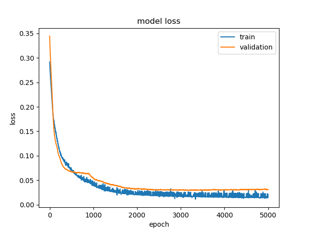
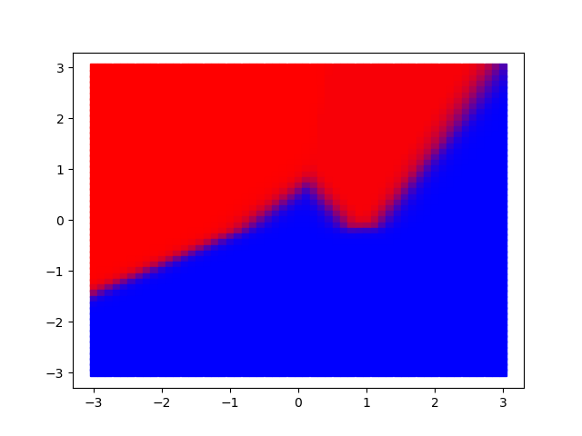

# keras-example
Artificial Neural Net example in Python using Keras and TensorFlow. This neural net implements a classifier and operates on the 'moons' data set from the scikit-learn package.

Here is the "moon data" that the model will train on:

Here is a snapshot of the model loss over the 5000 epoch training:

Here is the resultant decision boundary, with shading that represents the confidence near the boundary:

